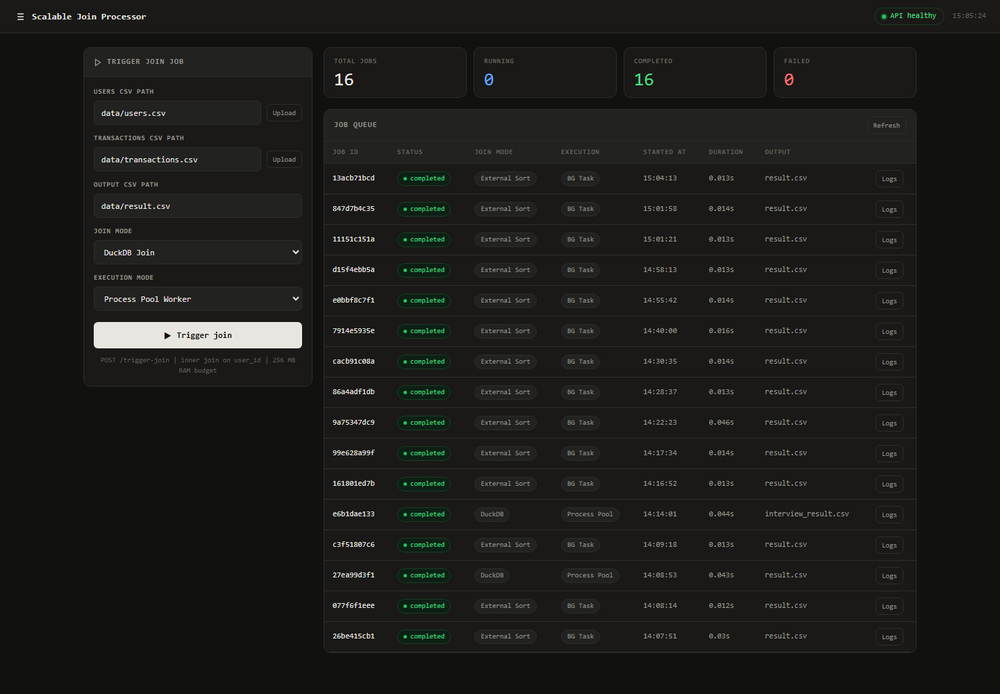
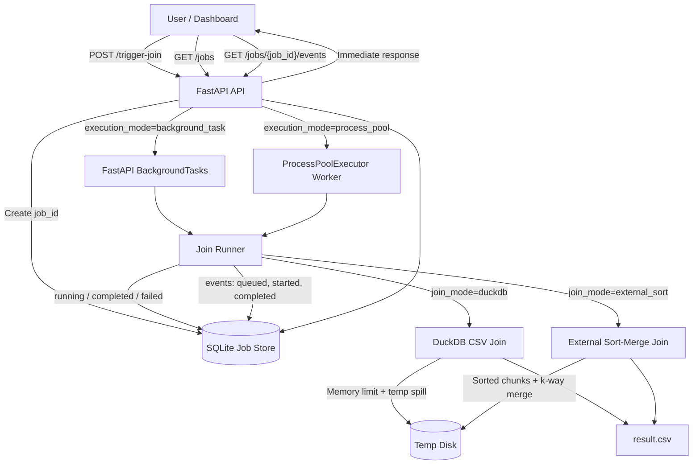

# Scalable Join Processor

Production-style FastAPI service for joining large CSV datasets without loading them fully into memory. The project implements the NewGenesis Software Design Engineer assessment: an out-of-core data join plus a non-blocking API that triggers the join as a background job.

## Preview



## What This Solves

Large CSV joins are risky inside a normal request-response API. Loading two 500 MB CSVs with `pandas.read_csv()` and `merge()` can exceed memory limits, block the web server, and cause timeouts under concurrent use.

This project uses a job-based architecture:

- The API accepts a join request and immediately returns a `job_id`.
- The join runs outside the request path.
- Job status and events are stored in SQLite.
- The frontend polls the API and shows real job progress.
- The join output is streamed to a CSV file.

## Assignment Coverage

| Requirement | Implementation |
| --- | --- |
| Join `users.csv` and `transactions.csv` on `user_id` | `duckdb_join.py` and `external_sort_join.py` |
| Avoid loading full datasets into memory | DuckDB memory limit and pure Python chunked external sort |
| Output `result.csv` | Configurable `output_path` written by both join engines |
| FastAPI endpoint to trigger join | `POST /trigger-join` |
| Return immediately with job ID | API returns `job_id` with `queued` status |
| Run join in background | `BackgroundTasks` and `ProcessPoolExecutor` |
| Implement at least two approaches | Two join approaches and two API execution approaches |
| Log job start and finish | SQLite job events plus rotating file logs |
| Explain pros and cons | Dashboard comparison panel and `docs/approaches.md` |

## Architecture Flow



## Core Design

### Join Approach 1: DuckDB

DuckDB is the practical default. It scans CSV files directly, applies a memory limit, can spill intermediate work to disk, and writes the joined output without creating large Python DataFrames.

Best for:

- Real-world analytics workloads.
- Fast local demos.
- Clear explanation under the 256 MB RAM constraint.

### Join Approach 2: External Sort-Merge

The pure Python implementation reads each CSV in chunks, sorts chunks by `user_id`, writes sorted chunks to disk, performs a k-way merge, and streams matching rows into the result file.

Best for:

- Showing explicit out-of-core algorithm knowledge.
- Environments where a database engine is not allowed.
- Explaining why chunking and streaming matter.

### API Approach 1: FastAPI BackgroundTasks

Simple non-blocking approach. The API returns a response first, then FastAPI runs the job after the response has been sent.

### API Approach 2: ProcessPoolExecutor

Better local/container approach for CPU-heavy jobs. The web process stays responsive while a separate worker process performs the join.

## API

### `POST /trigger-join`

Starts a join job and returns immediately.

```json
{
  "users_path": "data/users.csv",
  "transactions_path": "data/transactions.csv",
  "output_path": "data/result.csv",
  "join_mode": "duckdb",
  "execution_mode": "process_pool"
}
```

Response:

```json
{
  "job_id": "27ea99d3f1054529a4721d256b65a73a",
  "status": "queued",
  "message": "Join job queued. Use the job_id to check status."
}
```

### `GET /jobs`

Returns all jobs, latest first.

### `GET /jobs/{job_id}`

Returns one job record with status, paths, duration, and error if any.

### `GET /jobs/{job_id}/events`

Returns job lifecycle events.

### `GET /health`

Health check endpoint.

## Run Locally

```powershell
python -m venv .venv
.\.venv\Scripts\Activate.ps1
pip install -r requirements.txt
```

Generate demo data:

```powershell
python scripts\generate_data.py --users 10000 --transactions 25000 --output-dir data
```

Start the API:

```powershell
uvicorn app.main:app --reload
```

Open:

```txt
http://127.0.0.1:8000
```

## Full-Scale Data

To generate assignment-sized files:

```powershell
python scripts\generate_data.py --users 5000000 --transactions 10000000 --output-dir data
```

Then trigger the job from the dashboard or with:

```powershell
curl -X POST http://127.0.0.1:8000/trigger-join `
  -H "Content-Type: application/json" `
  -d "{\"users_path\":\"data/users.csv\",\"transactions_path\":\"data/transactions.csv\",\"output_path\":\"data/result.csv\",\"join_mode\":\"duckdb\",\"execution_mode\":\"process_pool\"}"
```

## Tests

```powershell
pytest
```

Expected:

```txt
3 passed
```

The tests verify:

- DuckDB join output.
- External sort-merge join output.
- API job creation, completion, and job events.

## Deployment

The app has also been deployed as a lightweight hosted demo:

[https://newgenassignment.vercel.app](https://newgenassignment.vercel.app)

The production demo uses the same FastAPI app and dashboard. Since Vercel is serverless, it uses committed sample CSV files and `background_task` mode for the hosted demo. Locally or on a long-running service such as Render, the same app can use `process_pool`.

Deployment process:

1. Install dependencies from `requirements.txt`.
2. Run the FastAPI app with `uvicorn app.main:app`.
3. For Vercel, route requests through `api/index.py` and `vercel.json`.
4. For Render, use `render.yaml` with `uvicorn app.main:app --host 0.0.0.0 --port $PORT`.
5. Keep Python pinned to `3.11.11` for stable DuckDB binary wheels.

## Project Structure

```txt
app/
  main.py                 FastAPI routes and app setup
  jobs.py                 SQLite job store and worker orchestration
  models.py               Pydantic request/response models
  settings.py             Local/Vercel runtime paths
joiners/
  duckdb_join.py          DuckDB-backed out-of-core join
  external_sort_join.py   Pure Python external sort-merge join
scripts/
  generate_data.py        Synthetic CSV data generator
static/
  index.html              Dashboard frontend
docs/
  approaches.md           Pros and cons write-up
  assets/dashboard.png    README screenshot
tests/
  test_api.py             API job tests
  test_joiners.py         Join engine tests
```

## Interview Explanation

The shortest defensible explanation:

> This is a local prototype of a production data-processing system. The API does not do heavy work inside the HTTP request. It creates a job, returns a job ID, and runs a memory-safe CSV join in the background. DuckDB is the practical engine for fast out-of-core joins, and the external sort-merge implementation shows the underlying algorithm. The dashboard proves the API is non-blocking by tracking queued, running, completed, and failed jobs.
